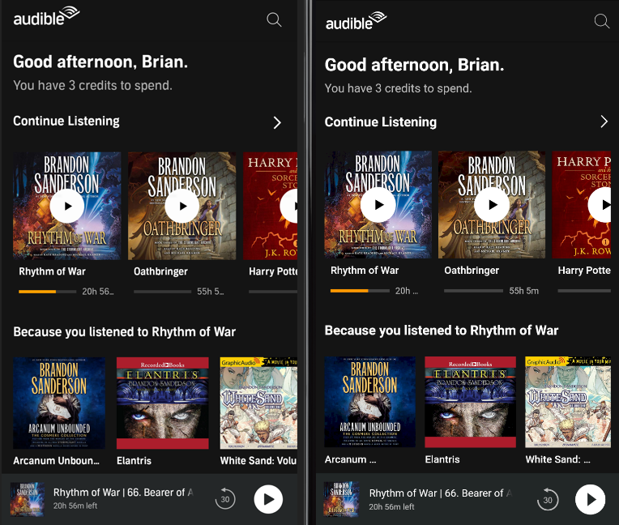

Building a mostly non-functional Audible app clone in Flutter for the sake of learning how to layout and style better.

Flutter Web version: https://flaudible-app.web.app/

Current side-by-side with a random screenshot from my phone (left: phone, right: Flutter):

